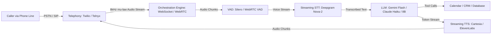

# AI Receptionist — System Architecture & Blueprint

A comprehensive architectural guide, technical blueprint, and execution roadmap for building a production-grade, low-latency AI virtual receptionist for businesses.

---

## 1. Executive Summary & Core Value Proposition

Small and medium-sized service businesses (clinics, home services, law firms, salons) lose massive revenue to unanswered calls:
* Over **60% of calls** to small businesses go unanswered.
* **80%+ of callers** who encounter voicemail hang up and call the next competitor.
* Every missed call represents a lost job or customer lifetime value ranging from **\$300 to \$3,000+**.

The primary objective of the AI Receptionist is **zero missed calls**: 24/7 call answering, real-time calendar booking, rescheduling, message triage, emergency escalation, and immediate post-call SMS confirmations.

---

## 2. Niche Selection Strategy

Building a generic "AI receptionist for everyone" creates friction with varying workflows and software. Selecting a target vertical first maximizes conversion:

| Vertical | Primary Integration | Key Complexity | Urgency / Value |
| :--- | :--- | :--- | :--- |
| **Home Services** (Plumbing, HVAC, Roofing) | ServiceTitan, Jobber, Housecall Pro | Emergency dispatch vs. routine quotes | **Very High** (Burst pipes, AC failure) |
| **Dental & Medical Clinics** | Dentrix, AthenaHealth, Kareo | HIPAA compliance, insurance verification | **High** (High patient lifetime value) |
| **Boutique Salons & Spas** | Mindbody, Boulevard, Fresha | Staff-specific calendars, add-on upsells | **Medium** (High frequency of bookings) |
| **Legal / Professional Services** | Clio, PracticePanther | Strict conflict-of-interest check, triage | **Very High** (Lead qualification value) |

---

## 3. System Architecture & Pipeline

Voice AI requires a continuous, real-time pipeline with a total end-to-end **latency budget under 600–800ms**.



### Component Breakdown

1. **Telephony Layer**:
   * Carriers: **Twilio**, **Telnyx**, or **Vonage**.
   * Provides virtual phone numbers or receives forwarded calls from existing office PBX systems.
   * Streams audio bidirectionally via WebSockets using 8kHz $\mu$-law (mu-law) audio format.

2. **Voice Activity Detection (VAD) & Turn-Taking**:
   * Engine: **Silero VAD** or WebRTC VAD.
   * Detects the exact millisecond the user starts and stops speaking.

3. **Speech-to-Text (STT)**:
   * Engine: **Deepgram Nova-2** (preferred for phone audio) or **Faster-Whisper**.
   * Must support live streaming transcripts with interim and final tokens.

4. **Intelligence (LLM Brain)**:
   * Models: **Gemini 1.5/2.0 Flash**, **Claude 3.5 Haiku**, or **GPT-4o-mini**.
   * For self-hosted: **Llama-3.1-8B-Instruct** on **vLLM**.
   * Employs structured tool/function calling to interact with calendar systems.

5. **Text-to-Speech (TTS)**:
   * Engine: **Cartesia Sonic** (~100ms TTFT) or **ElevenLabs Turbo v2.5**.
   * Streams synthesized audio chunks directly back to the telephony socket.

---

## 4. Model Selection & Fine-Tuning Analysis

### Should You Fine-Tune an Existing Model?
* **Verdict: NO for MVP and v1.**
* **Why**: Fine-tuning often breaks or degrades reliable JSON schema following / function calling. It also makes prompt updates and guardrail tweaks rigid and expensive.
* **Better Approach**: Use **In-Context Prompting + Strict Function Calling (JSON Schemas)**.

### Model Parameter Breakdown
* **Cloud API Models (Recommended)**:
  * **Size**: Equivalent to small/frontier-distilled models (~8B–14B effective parameter latency).
  * **Latency**: 100ms–250ms Time To First Token (TTFT).
  * **Accuracy**: >95% reliability on complex function calling and multi-slot scheduling logic.
* **Self-Hosted Models (If data privacy is non-negotiable)**:
  * **Sweet Spot**: **8 Billion Parameters** (`Llama-3.1-8B-Instruct`).
  * **Hardware**: Single NVIDIA RTX 4090 (24GB) or A10G with vLLM / TensorRT-LLM.
  * **Why not 70B+?**: 70B models have a TTFT of 400ms–900ms under standard hardware, which breaches the real-time audio latency budget.

---

## 5. Critical "Unspoken" Engineering Challenges

| Challenge | Why It Breaks Naive Implementations | Solution |
| :--- | :--- | :--- |
| **Barge-in / Interruption** | If the caller interrupts (*"Wait, I meant Friday"*), the AI continues reading the old response over the caller. | Listen to incoming audio packets while TTS is playing. The moment VAD detects caller speech, cancel the TTS stream, clear the audio buffer, and abort the LLM generation. |
| **Audio Transcoding** | Telephony uses **8kHz $\mu$-law mono**, while modern TTS engines output **24kHz/48kHz PCM or MP3**. | Perform in-memory audio resampling using `audioop` or native C bindings without writing files to disk. |
| **Turn-Taking Latency** | Setting silence detection too long (1s) causes awkward dead air; setting it too short (200ms) cuts callers off mid-breath. | Use adaptive silence thresholding (typically 400ms–600ms) combined with semantic end-of-thought detection. |
| **Double-Booking & Race Conditions** | If an LLM encounters a network timeout while calling a calendar API, retrying can book duplicate appointments. | Implement **idempotency keys** and Redis-based slot reservation locks before confirming verbally. |

---

## 6. Step-by-Step Implementation & Difficulty Matrix

| Step | Scope | Difficulty | Typical Tools / Libraries |
| :--- | :--- | :--- | :--- |
| **1. Telephony Setup** | Webhook configuration, number rental, SIP routing | **Easy** | Twilio Voice API, TwiML `<Connect><Stream>` |
| **2. WebSocket Streaming** | Bi-directional raw audio stream handling | **Medium** | FastAPI WebSockets, Node.js `ws` |
| **3. Audio Transcoding & VAD** | Real-time audio decoding and speech boundary detection | **Hard** | Silero VAD, WebRTC VAD, Python `audioop` |
| **4. Live STT Integration** | Streaming audio to transcription provider | **Easy** | Deepgram Streaming WebSocket SDK |
| **5. Orchestration State Machine** | Coordinating barge-in, cancellation tokens, speech queues | **Very Hard** | LiveKit Agents or custom async state machine |
| **6. Scheduling Logic & Tools** | Checking availability, booking, updating appointments | **Medium** | Cal.com API, Google Calendar API, PostgreSQL |
| **7. Streaming TTS** | Streaming text chunks to voice audio chunks | **Easy** | Cartesia Sonic WebSocket API, ElevenLabs API |
| **8. Post-Call Automation** | Instant SMS confirmation, owner digest, CRM log | **Easy** | Twilio SMS, SendGrid, WhatsApp Business API |

---

## 7. The Three Build Approaches

```
+-----------------------------------------------------------------------------------+
| APPROACH 1: 100% Custom / Bare Metal                                             |
| Stack: Asterisk/FreeSWITCH + Silero + Faster-Whisper + Local Llama-8B + Piper TTS  |
| Difficulty: 9.5 / 10 | Dev Time: 6-12 Months | Cost: $500-$2,000/mo GPU Servers   |
| Verdict: Avoid for MVP. High operational burden and complex SIP maintenance.       |
+-----------------------------------------------------------------------------------+
                                         │
+----------------------------------------▼------------------------------------------+
| APPROACH 2: The Modular Framework (The Engineer's Sweet Spot)                     |
| Stack: LiveKit Agents + Twilio + Deepgram + Gemini Flash / Haiku + Cartesia       |
| Difficulty: 5.5 / 10 | Dev Time: 2-4 Weeks | Cost: ~$0.05 - $0.08 / minute        |
| Verdict: Best balance of ownership, scalability, and performance.                 |
+-----------------------------------------------------------------------------------+
                                         │
+----------------------------------------▼------------------------------------------+
| APPROACH 3: Voice Wrapper / Rapid MVP                                             |
| Stack: Vapi / Retell AI + Custom FastAPI Backend + Cal.com API                    |
| Difficulty: 2.0 / 10 | Dev Time: 2-4 Days | Cost: ~$0.12 - $0.18 / minute         |
| Verdict: Ideal for testing product-market fit before optimizing infrastructure.   |
+-----------------------------------------------------------------------------------+
```

---

## 8. Sample Tool / Function Calling Schema

Below is the standard JSON tool schema provided to the LLM for slot verification and booking:

```json
[
  {
    "name": "check_available_slots",
    "description": "Check open appointment slots for a specific service and date range.",
    "parameters": {
      "type": "object",
      "properties": {
        "service_type": {
          "type": "string",
          "enum": ["consultation", "repair", "emergency_visit", "routine_checkup"]
        },
        "start_date": {
          "type": "string",
          "description": "ISO 8601 date string (YYYY-MM-DD)"
        },
        "end_date": {
          "type": "string",
          "description": "ISO 8601 date string (YYYY-MM-DD)"
        }
      },
      "required": ["service_type", "start_date"]
    }
  },
  {
    "name": "book_appointment",
    "description": "Reserve a confirmed time slot for a caller.",
    "parameters": {
      "type": "object",
      "properties": {
        "customer_name": { "type": "string" },
        "customer_phone": { "type": "string" },
        "service_type": { "type": "string" },
        "slot_timestamp": {
          "type": "string",
          "description": "ISO 8601 format (e.g. 2026-10-15T14:30:00Z)"
        },
        "notes": { "type": "string" }
      },
      "required": ["customer_name", "customer_phone", "service_type", "slot_timestamp"]
    }
  }
]
```

---

## 9. Recommended MVP Roadmap (14 Days)

* **Days 1–3: Prototype Voice Flow (Approach 3)**
  * Set up a free account on Retell AI or Vapi.
  * Connect a Twilio phone number.
  * Configure system prompt and conversational voice tone.
* **Days 4–7: Backend & Booking Integration**
  * Spin up a lightweight FastAPI or Node.js server.
  * Connect Cal.com or Google Calendar API webhooks for slot lookup and reservation.
  * Configure instant SMS confirmation via Twilio on call completion.
* **Days 8–10: Business Knowledge & Guardrails**
  * Ingest business operating hours, address, pricing guidelines, and FAQ.
  * Implement human transfer fallback logic (transfer to business owner's mobile).
* **Days 11–14: Real-World Testing & Outreach**
  * Test with mock callers across varied accents, background noise, and intentional interruptions.
  * Offer pilot testing to 2–3 local service businesses.
